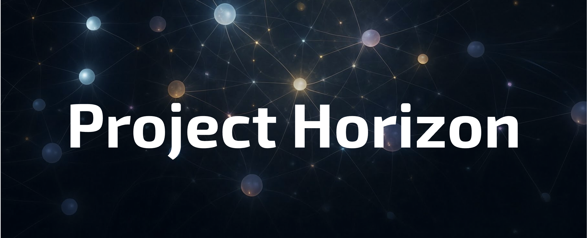
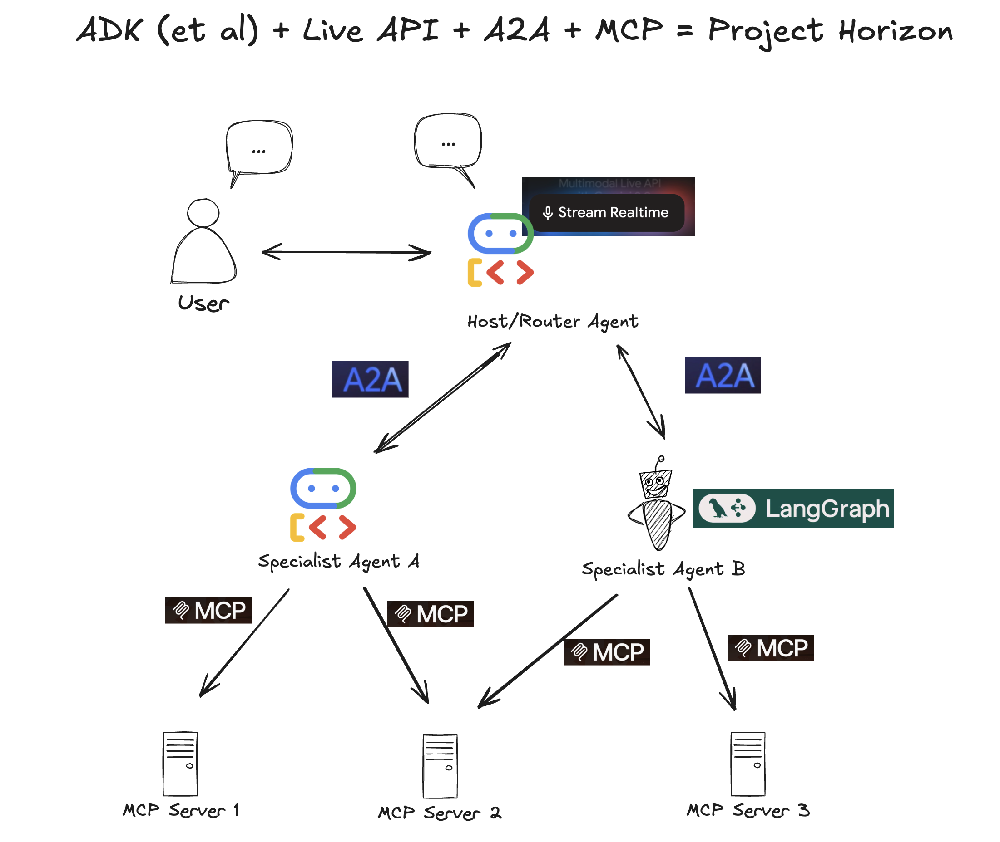
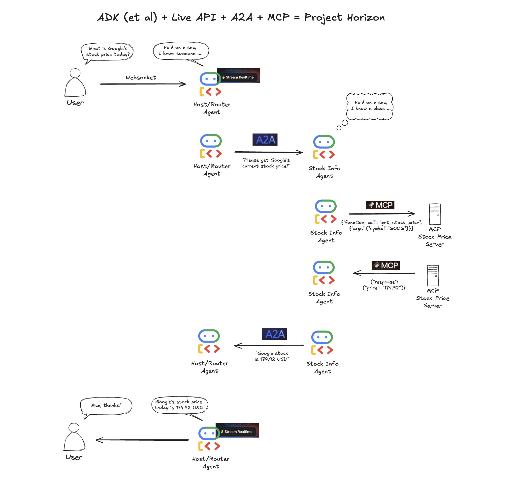

# Project Horizon

## Exploring the Future of Interoperable, Multimodal AI Agent Systems

---


---

## Overview

**Project Horizon explores the future of collaborative, multimodal AI agent systems.** It investigates how sophisticated, responsive, and interoperable agents can be built by integrating cutting-edge agent development frameworks and open communication protocols. This proof-of-concept demonstrates the powerful synergy between **Google's Agent Development Kit (ADK)** (leveraging the **Gemini Live API** for real-time interaction), the **Agent2Agent (A2A) protocol**, and the **Model Context Protocol (MCP)**.



This project serves as a reference implementation and a testbed for:

*   Integrating diverse agent frameworks and tools.
*   Implementing real-time, interactive user experiences (voice, video, text) using ADK's `run_live` powered by the Gemini Live API.
*   Establishing standardized communication patterns between independent agents (A2A).
*   Enabling agents to securely interact with external tools and data sources (MCP).
*   Exploring advanced agent architectures, design patterns, and evaluation techniques.

**Project Horizon aims to capture and demonstrate the future of agent interactions, providing technical implementations, architectural blueprints, and practical design patterns for building the next generation of AI applications.**

## Potential & Vision

Project Horizon is more than just a demonstration of a single capability; it's a foundation for exploring the future of collaborative AI:

*   **Interoperability Blueprint:** Provides a concrete example of how systems built with different frameworks (ADK, potentially LangChain/CrewAI via A2A/MCP wrappers) can communicate using open standards.
*   **Modular Agent Design:** Demonstrates the benefits of breaking down complex tasks into specialized agents communicating via A2A.
*   **Secure Tool Integration:** Showcases MCP as a standardized, potentially more secure way for agents to access external capabilities compared to direct API calls or embedding tool logic within the agent itself.
*   **Multimodal Interaction:** Leverages ADK `run_live` for cutting-edge, real-time voice and potentially video interactions.
*   **Design Pattern Exploration:** Serves as a platform to implement and compare different agent architectures (e.g., hierarchical delegation, parallel execution via A2A, sequential workflows combining A2A and MCP calls).
*   **Foundation for Asynchronicity:** While starting synchronous, the architecture is designed to evolve towards handling asynchronous tasks, long-running operations, and push notifications using A2A/MCP capabilities.

**Ultimately, Project Horizon aims to be a valuable resource for developers seeking to build robust, scalable, and interoperable multi-agent systems.**

## Core Technologies Showcased

*   **[Google Agent Development Kit (ADK)](https://google.github.io/adk-docs/):** Utilized for the primary user-facing "Host Agent", providing the `run_live` framework for agent orchestration and multimodal communication management.
*   **[Gemini Live API](https://ai.google.dev/gemini-api/docs/live):** Enables the low-latency, bidirectional, streaming voice (and potentially video) interactions with the Gemini model, powering the real-time user experience within ADK's `run_live`.
*   **[Agent2Agent Protocol (A2A)](https://google.github.io/A2A/):** The open standard used for communication and task delegation between the ADK Host Agent and backend "Specialist Agents". Enables interoperability between potentially different agent implementations.
*   **[Model Context Protocol (MCP)](https://modelcontextprotocol.io/):** The open standard allowing Specialist Agents (acting as MCP Clients) to securely interact with dedicated "Tool Servers" (MCP Servers) that provide access to specific functionalities or data (e.g., fetching stock prices).

## Current Scenario Demonstrated (v0.1.1 - Synchronous Stock Lookup with Improved Init)

The proof-of-concept focuses on a clear, synchronous end-to-end flow: **Real-Time Stock Price Lookup**.

**User Interaction:**
The user interacts with the Host Agent via a simple web UI, primarily using voice input. They ask for the current price of a stock (e.g., *"What is the price of Microsoft?"*).

**Execution Flow:**

0.  **Server Startup & Initialization (FastAPI & ADK):**
    *   When `app/live_server.py` is started (e.g., via `python -m app.live_server`), the FastAPI application initializes.
    *   FastAPI's `@app.on_event("startup")` decorator triggers the `startup_event` asynchronous function.
    *   `startup_event` calls `await initialize_adk_system()`.
        *   `initialize_adk_system()` calls `await create_host_agent()` from `host_agent/agent.py`.
        *   `create_host_agent()` in turn calls `await initialize_specialist_agents_discovery()` from `host_agent/tools.py`. This function fetches the Agent Card(s) of configured specialist agents (e.g., StockInfoAgent) and caches their details.
        *   The `HostAgent` instance is then created, its system instruction dynamically populated with information about the discovered specialist agents.
        *   Finally, the global ADK `Runner` instance within `live_server.py` is initialized with this fully configured `HostAgent`.
    *   Only after `initialize_adk_system()` completes does the FastAPI server begin accepting WebSocket connections and HTTP requests.

1.  **Input (ADK Live):** The frontend captures user audio and streams it via WebSocket to the ADK Live Server (`app/live_server.py`'s `/ws/{session_id}` endpoint).
2.  **Host Agent Processing (ADK):** The `live_server` (now with an initialized `Runner`) passes the input to the ADK `Runner` managing the `HostAgent`. The `HostAgent` (using a Live API compatible Gemini model) processes the audio/text input. Guided by its dynamic system prompt (which includes descriptions of discovered specialists like "StockInfoAgent\_A2A"), it identifies the user's intent and the stock ticker symbol (e.g., "MSFT").
3.  **Tool Invocation (ADK -> A2A Client):** The `HostAgent`'s LLM decides to use the `delegate_task_to_specialist` tool. It provides the `specialist_agent_name` (e.g., "StockInfoAgent\_A2A") and `query_payload` (e.g., "MSFT") as arguments. This tool acts as an A2A Client.
4.  **Delegation (A2A Request):** The `delegate_task_to_specialist` tool (in `host_agent/tools.py`) looks up the "StockInfoAgent\_A2A" in its `DISCOVERED_SPECIALIST_AGENTS` cache, retrieves its A2A endpoint URL (from the Agent Card), constructs an A2A `tasks/send` request containing the ticker symbol, and sends it via HTTP POST to the `StockInfoAgent`.
5.  **Task Reception (A2A Server):** The `StockInfoAgent` (`specialist_agents/stock_info_agent/__main__.py`), acting as an A2A Server, receives the HTTP request and parses the A2A task.
6.  **ADK Agent Execution (within A2A Server):** The `StockInfoTaskManager`'s `on_send_task` method is invoked. This method instantiates the ADK `stock_info_agent` (using `create_agent_with_mcp_tools` from `specialist_agents/stock_info_agent/agent.py`). `create_agent_with_mcp_tools` in turn initializes its `MCPToolset` by launching the `StockToolServer` (`mcp_servers/stock_mcp_server/server.py`) as a subprocess and captures the necessary `exit_stack` for cleanup. The Task Manager then creates and starts a temporary ADK `Runner` for this specialist ADK agent instance.
7.  **MCP Tool Call (via ADK Agent & Toolset):** The temporary ADK `Runner` executes the `stock_info_agent`. The agent's LLM processes the input query (e.g., "What is the stock price for MSFT?") and decides to use the `get_current_stock_price` tool (which was loaded from the MCP server). The agent's `MCPToolset` handles establishing the stdio connection and sending the actual MCP `tools/call` request to the running `StockToolServer` subprocess.
8.  **Tool Execution (MCP Server):** The `StockToolServer`, acting as an MCP Server (using FastMCP), receives the request via stdin, executes the `get_current_stock_price` function (which uses the `yfinance` library), and gets the stock data.
9.  **MCP Response (stdio):** The `StockToolServer` sends the result (price/currency dictionary or error) back as an MCP JSON-RPC response via stdout.
10. **ADK Agent Receives Tool Result & Task Manager Extracts Result:** The `MCPToolset` within the specialist ADK agent receives the MCP response, parses it, and the `Runner` yields it as a `FunctionResponse` event. The `StockInfoTaskManager`'s `on_send_task` method, iterating through these events, extracts the stock data dictionary. Once the `Runner`'s execution loop finishes, the `finally` block in `on_send_task` calls `await exit_stack.aclose()`, terminating the `StockToolServer` subprocess.
11. **Task Completion (A2A Response):** The `StockInfoTaskManager` formats the extracted stock data (or error) into an A2A Artifact (within a `Task` object marked as COMPLETED or FAILED) and sends it back as the HTTP response to the Host Agent's A2A Client tool.
12. **Tool Result (A2A Client -> ADK):** The `delegate_task_to_specialist` tool in the `HostAgent` receives the A2A HTTP response, parses the result/artifact, and returns the dictionary to the ADK `Runner`.
13. **Final Response Generation (ADK):** The `HostAgent` receives the tool result dictionary. Its LLM formulates a natural language response (e.g., "Microsoft is trading at $XXX.XX USD.").
14. **Audio Output (ADK Live):** ADK synthesizes the text response into audio using the configured Live API model/voice.
15. **Streaming Output (ADK Live -> UI):** The `live_server` streams the audio chunks via WebSocket back to the user interface, where it is played back in real-time.



**This phase successfully validates the core integration points between ADK Live, A2A (with dynamic agent card discovery), and MCP over stdio in a synchronous workflow.**

## Getting Started

For detailed setup, execution, and testing instructions for each component, please refer to the comprehensive [Getting Started Guide](./GETTING_STARTED.md).

### Prerequisites

*   Python (>= 3.9 required by MCP, >= 3.11 recommended for latest ADK/async features)
*   `pip` (Python package installer)
*   Git
*   Access to Google Cloud / Google AI Studio (for Gemini API Key/Credentials)
*   An API key for a Gemini model supporting the Live API (e.g., `gemini-2.0-flash-exp`).
*   Basic understanding of ADK, A2A, and MCP concepts.
*   Familiarity with `asyncio` and web frameworks (FastAPI/Starlette).

### Installation

1.  **Clone the Repository:**
    ```bash
    git clone <your-repo-url>
    cd project-horizon
    ```
2.  **Set up Virtual Environment:**
    ```bash
    python -m venv .venv
    source .venv/bin/activate  # Linux/macOS
    # .venv\Scripts\activate  # Windows
    ```
3.  **Install Dependencies:**
    ```bash
    pip install -r requirements.txt
    ```

### Configuration (`.env`)

1.  **Copy the Example:** In the project root, copy the `.env.example` file to a new file named `.env`.
    ```bash
    cp .env.example .env
    ```
2.  **Edit `.env`:** Open the newly created `.env` file and populate it with your specific configuration values. Refer to the comments within `.env.example` (and replicated below) for guidance on each variable.

Key variables you will need to set:
*   `GOOGLE_GENAI_USE_VERTEXAI`: **Mandatory.** Must be set to `"True"` or `"False"` to determine the API authentication method.
*   If `GOOGLE_GENAI_USE_VERTEXAI="False"` (for Google AI Studio):
    *   `GOOGLE_API_KEY`: **Mandatory.** Your API key for Google AI Studio.
*   If `GOOGLE_GENAI_USE_VERTEXAI="True"` (for Vertex AI):
    *   `GOOGLE_CLOUD_PROJECT`: **Mandatory.** Your Google Cloud Project ID.
    *   `GOOGLE_CLOUD_LOCATION`: **Mandatory.** Your Google Cloud Project Location (e.g., `us-central1`).
*   `LIVE_SERVER_MODEL`: **Highly Recommended.** Specifies the Live API compatible model for the Host Agent. Defaults to "gemini-2.0-flash-live-001" if not set. Ensure the chosen model (either default or custom) is available and appropriate for your setup.
*   `LIVE_SERVER_HOST`: **Mandatory.** Host for the ADK Live Server (e.g., `127.0.0.1`). Essential for the UI to connect.
*   `LIVE_SERVER_PORT`: **Mandatory.** Port for the ADK Live Server (e.g., `8000`).
*   `SPECIALIST_AGENT_BASE_URLS`: **Mandatory.** Comma-separated list of base URLs for specialist A2A agents (e.g., `http://127.0.0.1:8001`). The Host Agent will fetch Agent Cards from these.
*   `STOCK_INFO_AGENT_A2A_SERVER_HOST`: **Mandatory** (e.g., `127.0.0.1`). Host for *running* the StockInfoAgent's A2A server.
*   `STOCK_INFO_AGENT_A2A_SERVER_PORT`: **Mandatory** (e.g., `8001`). Port for *running* the StockInfoAgent's A2A server.
*   `STOCK_INFO_AGENT_MODEL`: **Mandatory.** Model for the specialist agent (e.g., "gemini-2.0-flash-001").
*   `STOCK_MCP_SERVER_PATH`: **Mandatory** (e.g., `mcp_servers/stock_mcp_server/server.py`). Path to the MCP server script, used by the StockInfoAgent.
*   `MOCK_STOCK_API`: Set to `"True"` or `"False"` to enable/disable the mock stock API (Default is `FALSE`).


### Running the Demo

Execute the components in separate terminals from the project root directory (`project-horizon/`), ensuring your virtual environment is active in each.

1.  **Terminal 1: Start Specialist Agent (StockInfoAgent A2A Server)**
    ```bash
    python -m specialist_agents.stock_info_agent
    ```
    *Verify it starts listening on the correct port (e.g., 8001 as per `.env`) and uses the correct MCP server path.*

2.  **Terminal 2: Start ADK Live Server (Host Agent)**
    ```bash
    python -m app.live_server
    ```
    *Verify it starts, performs specialist agent discovery, and then listens on its port (e.g., 8000 as per `.env`). Check logs for discovery messages.*

3.  **Access UI:** Open your web browser to `http://<LIVE_SERVER_HOST>:<LIVE_SERVER_PORT>` (e.g., `http://127.0.0.1:8000`).

4.  **Interact:**
    *   Click "Connect".
    *   Click the Mic button, speak a stock request (e.g., "What is the price of Apple?").
    *   Click the Mic button again to stop recording.
    *   Listen for the audio response.
    *   Check the logs in both terminals to see the A2A and MCP interactions.
    *   Click "Stop" in the UI when finished.


## Future Plans / Roadmap

This PoC establishes the synchronous foundation. Future iterations aim to explore:

*   **Asynchronous A2A/MCP:** Implement non-blocking calls, potentially using A2A streaming or push notifications for long-running tool operations within the Specialist Agent -> MCP Server interaction.
*   **Parallel A2A Delegation:** Modify the Host Agent to delegate tasks to multiple Specialist Agents concurrently (e.g., fetch stock price AND company news simultaneously).
*   **MCP over HTTP/SSE:** Migrate the `StockToolServer` from stdio to http/sse transport, requiring security considerations (authentication middleware) for the Specialist Agent's MCP client connection.
*   **Advanced State Management:** Utilize ADK's persistent SessionService options (Database, Vertex AI) and explore state sharing patterns between agents.
*   **Error Handling & Resilience:** Implement more robust error handling, retries, and fallback mechanisms across all communication layers.
*   **Additional Specialist Agents & Tools:** Expand the system with more agents (e.g., NewsAgent, PortfolioAgent) and corresponding MCP Tool Servers.
*   **ADK Evaluation:** Integrate ADK's evaluation framework (`adk eval`) to measure performance and accuracy.
*   **UI Enhancements:** Improve the frontend to better visualize multi-agent activity, tool calls, and potentially handle more complex inputs/outputs.

## 📜 License

This project is licensed under the Apache License 2.0. See the [LICENSE](./LICENSE) file.

## 🤝 Contributing & Disclaimer

This is a personal project by [Heiko Hotz](https://github.com/heiko-hotz) to explore Gemini capabilities. Suggestions and feedback are welcome via Issues or Pull Requests.

**This project is developed independently and does not reflect the views or efforts of Google.**